ECE 5745 Tutorial 5: Synopsys ASIC Tools
==========================================================================

 - Author: Christopher Batten
 - Date: February 1, 2017

This tutorial will discuss the various views that make-up a standard-cell
library and then illustrate how to use a set of Synopsys ASIC tools to
map an RTL design down to these standard cells and ultimately silicon.
The tutorial will discuss the key tools used for synthesis,
place-and-route, and power analysis. This tutorial requires entering
commands manually for each of the tools to enable students to gain a
better understanding of the detailed steps involved in this process. The
next tutorial will illustrate how this process can be automated to
facilitate rapid design-space exploration. This tutorial assumes you have
already completed the tutorials on Linux, Git, PyMTL, and Verilog.

**Table of Contents**

 - Overview of ECE 5745 ASIC Tools
 - Synopsys Educational 90nm Standard-Cell Libraries
 - PyMTL-Based Testing, Simulation, Translation
 - Using Synopsys Design Compiler for Synthesis
 - Using Synopsys IC Compiler for Place-and-Route
 - Using Synopsys PrimeTime for Power Analysis
 - Using Verilog RTL Models
 - On Your Own

Overview of Synopsys ASIC Tools
--------------------------------------------------------------------------

The following diagram illustrates the four primary tools we will be using
in ECE 5745 along with a few smaller secondary tools. Notice that the
Synopsys ASIC tools all require various views from the standard-cell
library.

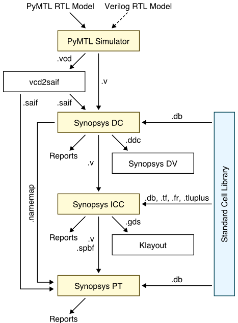

 1. We use the PyMTL framework to test, verify, and evaluate the
    execution time (in cycles) of our design. This part of the flow is
    very similar to the flow used in ECE 4750. Note that we can write our
    RTL models in either PyMTL or Verilog. Once we are sure our design is
    working correctly, we can then start to push the design through the
    flow. The ASIC flow requires Verilog RTL as an input, so we can use
    PyMTL's automatic translation tool to translate PyMTL RTL models into
    Verilog RTL. We also generate waveforms in `.vcd` (Verilog Change
    Dump) format, and we use `vcd2saif` to convert these waveforms into
    per-net average activity factors stored in `.saif` format. These
    activity factors will be used for power analysis.

 2. We use Synopsys Design Compiler (DC) to synthesize our design, which
    means to transform the Verilog RTL model into a Verilog gate-level
    netlist where all of the gates are selected from the standard-cell
    library. We need to provide Synopsys DC with abstract logical and
    timing views of the standard-cell library in `.db` format. We also
    provide provide Synopsys DC with the `.saif` file to enable mapping
    high-level RTL net names into low-level gate-level net names, and this
    mapping is stored in a `.namemap` file. This name mapping will be
    used for power analysis. In addition to the Verilog gate-level
    netlist, Synopsys DC can also generate a `.ddc` file which contains
    information about the gate-level netlist and timing, and this `.ddc`
    file can be inspected using Synopsys Design Vision (DV).

 3. We use Synopsys IC Compiler (ICC) to place-and-route our design,
    which means to place all of the gates in the gate-level netlist into
    rows on the chip and then to generate the metal wires that connect
    all of the gates together. We need to provide Synopsys ICC with the
    same abstract logical and timing views used in Synopsys DC, but we in
    addition we need to provide Synopsys ICC with technology information
    in `.tf` and `.tluplus` format and abstract physical views of the
    standard-cell library in `.fr` (Milkyway database) format.w Synopsys
    ICC will generate an updated Verilog gate-level netlist, a `.sbpf`
    file which contains parasitic resistance/capacitance information
    about all nets in the design, and a `.gds` file which contains the
    final layout. The `.gds` file can be inspected using the open-source
    Klayout GDS viewer. Synopsys ICC also generates reports which can be
    used to accurately characterize area and timing.

 4. We use Synopsys PrimeTime (PT) to perform power-analysis of our
    design. We need to provide Synopsys PT with the same abstract
    logical, timing, and power views used in Synopsys DC and ICC, but in
    addition we need to provide switching activity information for every
    net in the design (which comes from the `.saif` file), capacitance
    information for every net in the design (which comes from the `.sbpf`
    file), and a file which maps high-level RTL names to low-level
    gate-level names (which comes from the `.namemap` file). Synopsys PT
    puts the switching activity, capacitance, clock frequency, and
    voltage together to estimate the power consumption of every net and
    thus every module in the design, and these estimates are captured in
    various reports.

Extensive documentation is provided by Synopsys for Design Compiler, IC
Compiler, and PrimeTime. We have organized this documentation and made it
available to you on the [public course
webpage](http://www.csl.cornell.edu/courses/ece5745/syndocs). The
username/password was distributed during lecture.

You should start by cloning the tutorial repository from GitHub. Access
an `ecelinux` machine and use the following commands:

```
 % source setup-ece5745.sh
 % mkdir $HOME/ece5745
 % cd $HOME/ece5745
 % git clone git@github.com:cornell-ece5745/ece5745-tut5-asic-tools
 % cd ece5745-tut5-asic-tools
 % TOPDIR=$PWD
```

Synopsys Educational 90nm Standard-Cell Libraries
--------------------------------------------------------------------------

A standard-cell library is a collection of combinational and sequential
logic gates that adhere to a standardized set of logical, electrical, and
physical policies. For example, all standard cells are usually the same
height, include pins that align to a predetermined vertical and
horizontal grid, include power/ground rails and nwells in predetermined
locations, and support a predetermined number of drive strengths. A
standard-cell designer will usually create a high-level behavioral
specification (in Verilog), circuit schematics (in a `.cdl` Spice-like
format), and the actual layout (in `.gds` format) for each logic gate.
Synopsys DC, ICC, and PT do not actually use these low-level
implementations, since they are actually _too_ detailed. Instead these
tools use _abstract views_ of the standard cells, which capture logical
functionality, timing, geometry, and power usage at a much higher level.

Acquiring real standard-cell libraries is a complex and potentially
expensive process. It requires gaining access to a specific fabrication
technology, negotiating with a company which makes standard cells, and
usually signing multiple non-disclosure agreements. In this course, we
will be using the Synopsys Educational 90nm (SAED) standard-cell library.
This library was specifically designed by Synopsys for teaching. It is
based on a "fake" 90nm technology. This means you cannot actually tapeout
a design using this standard cell library, but the technology is
representative enough to provide reasonable area, energy, and timing
estimates for teaching purposes. In this section, we will take a look at
both the low-level implementations and high-level views of the SAED
standard-cell library.

A standard-cell library distribution can contain gigabytes of data in
thousands of files. For example, here is the distribution for the SAED
standard-cell library.

```
 % cd $STDCELLS_DIR/dist
```

To simplify using the SAED standard-cell library in this course, we have
created a much smaller set of symlinks which point to just the key files
we want to use in this course. Here is the directory which contains these
symlinks.

```
 % cd $STDCELLS_DIR
 % ls
 cells.cdl          # circuit schematics for each cell
 cells.gds          # layout for each cell
 cells.v            # behavioral specification for each cell

 cells.sp           # schematics with extracted parasitics for each cell
 cells.lib          # abstract logical, timing, power view for each cell
 cells.lef          # abstract physical view for each cell

 cells.tf           # interconnect technology information
 cells-tech.lef     # interconnect technology information
 cells-max.tluplus  # interconnect parasitic resistance/capacitance
 cells-min.tluplus  # interconnect parasitic resistance/capacitance

 cells.db           # binary compiled version of .lib file
 cells.fr           # Milkyway database built from .lef file

 cells.pdf          # standard-cell library databook
 cells.lyp          # layer settings for Klayout
```

Let's begin by looking at the schematic for a 3-input NAND cell
(NAND3X0).

```
 % less -p NAND3X0 cells.cdl
 .subckt NAND3X0 IN1 IN2 IN3 QN VDD VSS
 mmn2 net1 IN2 net2 VSS n12 l = 0.1u w = 0.52u m = 1
 mmn3 net2 IN3 VSS  VSS n12 l = 0.1u w = 0.52u m = 1
 mmn1 QN   IN1 net1 VSS n12 l = 0.1u w = 0.52u m = 1
 mmp1 QN   IN1 VDD  VDD p12 l = 0.1u w = 0.58u m = 1
 mmp2 QN   IN2 VDD  VDD p12 l = 0.1u w = 0.58u m = 1
 mmp3 QN   IN3 VDD  VDD p12 l = 0.1u w = 0.58u m = 1
 ends NAND3X0
```

For students with a circuits background, there should be no surprises
here, and for those students with less circuits background we will cover
basic static CMOS gate design later in the course. Essentially, this
schematic includes three NMOS transistors arranged in series in the
pull-down network, and three PMOS transistors arranged in parallel in the
pull-up network. The PMOS transistors are larger than the NMOS
transistors because the mobility of holes is less than the mobility of
electrons.

Now let's look at the layout for the 3-input NAND cell using the
open-source Klayout GDS viewer.

```
 % klayout -l $STDCELLS_DIR/cells.lyp $STDCELLS_DIR/cells.gds
```

Note that we are using the `.lyp` file which is a predefined layer color
scheme that makes it easier to view GDS files. To view the 3-input NAND
cell, find the NAND3X0 cell in the left-hand cell list, and then choose
_Display > Show as New Top_ from the menu. Here is a picture of the
layout for this cell.

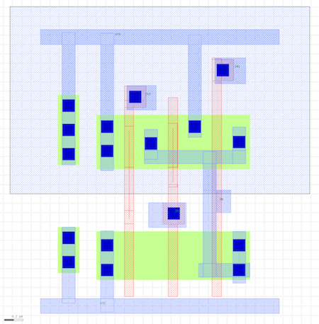

Diffusion is green, polysilicon is red, contacts are solid dark blue,
metal 1 (M1) is blue, and the nwell is the large gray rectangle over the
top half of the cell. All standard cells will be the same height and have
the nwell in the same place. Notice the three NMOS transistors arranged
in series in the pull-down network, and three PMOS transistors arranged
in parallel in the pull-up network. The standard cell also includes two
substrate contacts. The power rail is the horizontal strip of M1 at the
top, and the ground rail is the horizontal strip of M1 at the bottom. All
standard cells will have the power and ground rails in the same place so
they will connect via abutment if these cells are arranged in a row.
Although it is difficult to see, the three input pins and one output pin
are labeled squares of M1, and these pins are arranged to be on a
predetermined grid. Students with a circuits background may recognize
that this is not the highest quality layout. A commercial standard-cell
library will usually use very aggressive layout to optimize for area,
energy, and timing. Having said this, the SAED standard-cell library is
reasonable for the purposes of this course.

Now let's look at the Verilog behavior specification for the 3-input
NAND cell.

```
 % less -p NAND3X0 $STDCELLS_DIR/cells.cdl
 module NAND3X0 (IN1,IN2,IN3,QN);

 output  QN;
 input   IN1,IN2,IN3;

 nand #1 (QN,IN3,IN2,IN1);

 `ifdef functional
 `else
 specify
  specparam in1_lh_qn_hl=20,in1_hl_qn_lh=21,in2_lh_qn_hl=28,
  in2_hl_qn_lh=27,in3_lh_qn_hl=29,in3_hl_qn_lh=32;
  (        IN1 -=> QN) = (in1_hl_qn_lh,in1_lh_qn_hl);
  (        IN2 -=> QN) = (in2_hl_qn_lh,in2_lh_qn_hl);
  (        IN3 -=> QN) = (in3_hl_qn_lh,in3_lh_qn_hl);
 endspecify
 `endif

 endmodule
```

Note that the Verilog implementation of the 3-input NAND cell looks
nothing like the Verilog we used in ECE 4750. This cell is implemented
using a Verilog primitive gate (i.e., `nand`), it includes a delay value
of one delay unit (i.e., `#1`), and it includes a `specify` block which
is used for advanced gate-level simulation with back-annotated delays.

We can use sophisticated tools to extract detailed parasitic resistance
and capacitance values from the layout, and then we can add these
parasitics to the circuit schematic to create a much more accurate model
for experimenting with the circuit timing and power. Let's look at a
snippet of the extracted circuit for the 3-input NAND cell:

```
 % less -p NAND3X0 $STDCELLS_DIR/cells.sp
 .SUBCKT NAND3X0 VSS VDD IN3 IN1 IN2 QN
 ...
 Cg1 M6:DRN 0 1.83492e-17
 Cg2 M4:DRN 0 1.74201e-18
 Cg3 M1:DRN 0 1.13867e-17
 R1  M6:DRN M5:SRC 0.001
 R2  M6:DRN M4:DRN 423.29
 R3  M6:DRN QN 10.9403
 R4  M4:DRN QN 10.8355
 R5  QN M1:DRN 5.66819
 ...
 MM1 M1:DRN M1:GATE M1:SRC M1:BULK n12 ad=0.159p as=0.096p l=0.1u pd=1.65u ps=0.89u w=0.52u
 MM2 M2:DRN M2:GATE M2:SRC M2:BULK n12 ad=0.096p as=0.096p l=0.1u pd=0.89u ps=0.89u w=0.52u
 MM3 M3:DRN M3:GATE M3:SRC M3:BULK n12 ad=0.096p as=0.156p l=0.1u pd=0.89u ps=1.64u w=0.52u
 MM4 M4:DRN M4:GATE M4:SRC M4:BULK p12 ad=0.177p as=0.107p l=0.1u pd=1.77u ps=0.95u w=0.58u
 MM5 M5:DRN M5:GATE M5:SRC M5:BULK p12 ad=0.107p as=0.107p l=0.1u pd=0.95u ps=0.95u w=0.58u
 MM6 M6:DRN M6:GATE M6:SRC M6:BULK p12 ad=0.107p as=0.174p l=0.1u pd=0.95u ps=1.76u w=0.58u
 .ENDS
```

The full model is a couple of hundred lines long, so you can see how
detailed this model is! The ASIC tools do not really need this much
detail. We can use a special set of tools to create a much higher level
abstract view of the timing and power of this circuit suitable for use by
the ASIC tools. Essentially, these tools run many, many circuit-level
simulations to create characterization data stored in a `.lib` (Liberty)
file. Let's look at snippet of the `.lib` file for the 3-input NAND cell.

```
 % less -p NAND3X0 $STDCELLS_DIR/cells.lib
 cell (NAND3X0) {
  cell_footprint : "nand3x0 ";
  area : 7.3728 ;
  cell_leakage_power : 9.151417e+04;
  ...
  pin (IN1) {
    fanout_load : 0.059000;
    direction : "input";
    fall_capacitance : 2.212771;
    capacitance : 2.190745;
    rise_capacitance : 2.168719;
    ...
    internal_power () {
      when : "!IN2&!IN3";
      rise_power ("power_inputs_1") {
        /* index_1 = input transition time */
        index_1(" 0.0160000,  0.0320000,  0.0640000,  0.1280000,  0.2560000,  0.5120000,  1.0240000");
        values ("-1.2575404, -1.2594251, -1.2887053, -1.2413107, -1.2083520, -1.2261536, -1.1689351");
      }
      fall_power ("power_inputs_1") {
        /* index_1 = input transition time */
        index_1(" 0.0160000,  0.0320000,  0.0640000,  0.1280000,  0.2560000,  0.5120000,  1.0240000");
        values (" 1.9840914,  1.9791286,  2.0696119,  2.0561270,  2.0655292,  2.0637255,  2.0668630");
      }
  }
  ...
  pin (QN) {
    direction : "output";
    power_down_function : "!VDD + VSS";
    function : "(IN3*IN2*IN1)'";
    ...
    timing () {
      related_pin : "IN1";
      timing_sense : "negative_unate";
      cell_rise ("del_1_7_7") {
        /* index_1 = input net transition time */
        index_1("0.016, 0.032, 0.064, 0.128, 0.256, 0.512, 1.024");
        /* index_2 = total output net capacitance */
        index_2("0.1,   3.75,  7.5,   13,    26,    52,    104");
        values(
          "0.0178632, 0.0275957, 0.0374970, 0.0517788, 0.0856314, 0.1538226, 0.2886417", \
          "0.0215562, 0.0316225, 0.0414275, 0.0556431, 0.0895029, 0.1573472, 0.2917113", \
          "0.0261721, 0.0387623, 0.0496870, 0.0639978, 0.0973798, 0.1643430, 0.3008298", \
          "0.0323952, 0.0479363, 0.0614787, 0.0790854, 0.1144558, 0.1806003, 0.3153037", \
          "0.0413278, 0.0605217, 0.0771532, 0.0986336, 0.1423713, 0.2144832, 0.3477775", \
          "0.0540991, 0.0787062, 0.0997246, 0.1260550, 0.1797894, 0.2692040, 0.4165220", \
          "0.0712053, 0.1041857, 0.1296371, 0.1645895, 0.2318538, 0.3420702, 0.5237414");
      }
    }
  }
  ...
 }
```

This is just a small subset of the information included in the `.lib`
file for this cell. We will talk more about the details of such `.lib`
files later in the course, but you can see that the `.lib` file contains
information about area, leakage power, capacitance of each input pin,
internal power, logical functionality, and timing. Units for all data is
provided at the top of the `.lib` file. In this snippet you can see that
the area of the cell is 7.4 square micron and the leakage power is 9.2uW.
The capacitance for the input pin `IN`` is 2.1fF, although there is
additional data that capture how the capacitance changes depending on
whether the input is rising or falling. The output pin `QN` implements
the logic equation `(IN3*IN2*IN1)` (i.e., a NAND). Data within the `.lib`
file are often represented using one- or two-dimensional lookup tables
(i.e., a `values` table). You can see two such lookup tables in the above
snippet.

Let's start by focusing on the first lookup table. This table captures
the internal power, which is the power consumed within the gate itself,
as a function of one parameter: the input transition time. Longer input
transition times result in larger short-circuit current through the gate.
Note that the characterization data is for a specific configuration of
the input pins (i.e., `!IN2&!IN3`). There are other tables for the other
configurations of the input pins. Each entry in the lookup table is
calculated by measuring the current drawn from the power supply during a
detailed spice simulation and _subtracting_ any current used to charge
the output load. In other words all of the energy that is _not_ consumed
charging up the output load is considered internal energy. Note that some
of the internal power is negative. This is simply due to how we account
for energy. We can either assume all energy is consumed only when the
output node is charged and no energy energy is consumed when the output
node is discharged, _or_ we can assume half the energy is consumed when
the output is node is charged and half the energy is consumed when the
output node is discharged. In this case the library is using the second
approach, and the way the total energy is averaged across both
transitions can result in either the rising or falling internal power to
be negative. We will discuss this in greater detail later in the course.

Now let's focus on the second lookup table. This table captures the delay
from input pin `IN1` to output pin `QN` as a function of two parameters:
the input transition time (horizontal direction in lookup table) and the
load capacitance (vertical direction in lookup table). Gates are slower
when the inputs take longer transition and/or when they are driving large
output loads. Each entry in the lookup table reflects characterization of
one or more detailed circuit-level simulations. So in this example the
delay from input pin `IN1` to output pin `QN` is 31ps when the input
transition rate is 32ps and the output load is 3.75fF. This level of
detail can enable very accurate static timing analysis of our designs.

Note that the ASIC tools actually do not use the `.lib` file directly,
but instead use a pre-compiled binary version of the `.lib` file stored
in `.db` format. While the `.lib` file captures the abstract logical,
timing, and power aspects of the standard-cell library, it does not
capture the physical aspects of the standard-cell library. While the ASIC
tools could potentially use the `.gds` file directly, the ASIC tools do
not really need this much detail. We can use a special set of tools to
create a much higher level abstract view of the physical aspects of the
cell suitable for use by the ASIC tools. These tools create `.lef` files.
Let's look at snippet of the the `.lef` file for the 3-input NAND cell.

```
 % less -p NAND3X0 $STDCELLS_DIR/cells.lef
 MACRO NAND3X0
  CLASS CORE ;
  ORIGIN 0 0 ;
  SYMMETRY X Y ;
  SITE unit ;
  SIZE 2.56 BY 2.88 ;

  PIN VDD
    DIRECTION INOUT ;
    USE POWER ;
    PORT
    LAYER M1 ;
    RECT 0 2.8 2.56 2.96 ;
    RECT 1.585 1.805 1.725 2.8 ;
    RECT 0.645 1.45 0.785 2.8 ;
    RECT 0.23 1.51 0.37 2.8 ;
    END
  END VDD

  PIN QN
    DIRECTION OUTPUT ;
    USE SIGNAL ;
    PORT
    LAYER M1 ;
    RECT 1.745 1 2.04 1.24 ;
    RECT 1.115 1.525 2.2 1.665 ;
    ...
  END

  OBS
    LAYER PO ;
    RECT 1.84 0.1 1.94 2.115 ;
    RECT 1.84 2.115 2.07 2.345 ;
    RECT 0.9 0.1 1 2.125 ;
    ...
  END
```

This is just a small subset of the information included in the `.lef`
file for this cell. You can see the `.lef` file includes information on
the dimensions of the cell and the location and dimensions of both
power/ground and signal pins. The file also includes information on
"obstructions" (or blockages). These are regions of the cell which should
not be used for any purpose by the ASIC tools. You can use Klayout to
view `.lef` files as well.

```
 % klayout
```

Choose _File > Import > LEF_ from the menu. Navigate to the `cells.lef`
file. Here is a picture of the `.lef` for this cell.

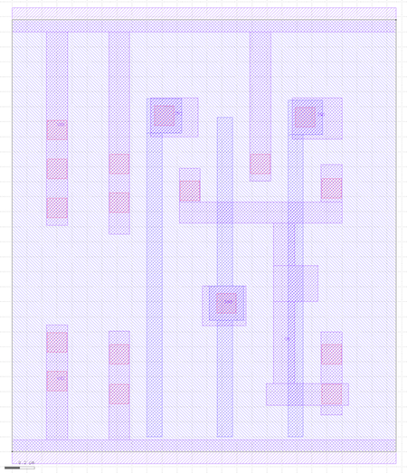

If you compare the `.lef` to the `.gds` you can see that the `.lef` is a
much simpler representation that only captures the boundary, pins, and
obstructions. The ASIC tools actually do not use the `.lef` file
directly, but instead use a pre-generated database version of the `.lef`
file stored in `.fr` (Milkyway) format.

The standard-cell library also includes several files (e.g., `.tf`,
`-tech.lef`, `.tluplus`) that capture information about the metal
interconnect including the wire width/pitch and parasitics.

Finally, a standard-cell library will always include a databook, which is
a document that describes the details of every cell in the library. Take
a few minutes to browse through the SAED standard-cell library databook.

PyMTL-Based Testing, Simulation, Translation
--------------------------------------------------------------------------

Our goal in this tutorial is to generate layout for the sort unit from
the PyMTL tutorial using the ASIC tools. As a reminder, the sort unit
takes as input four integers and a valid bit and outputs those same four
integers in increasing order with the valid bit. The sort unit is
implemented using a three-stage pipelined, bitonic sorting network and
the datapath is shown below.


Let's start by running the tests for the sort unit and note that the
tests for the `SortUnitStructRTL` will fail. You can just copy over your
implementation of the `MinMaxUnit` from when you completed the PyMTL
tutorial. If you have not completed the PyMTL tutorial then go back and
do that now.

```
 % mkdir $TOPDIR/sim/build
 % cd $TOPDIR/sim/build
 % py.test ../tut3_pymtl/sort
 % py.test ../tut3_pymtl/sort --test-verilog
```

The `--test-verilog` command line option tells the PyMTL framework to
first translate the sort unit into Verilog, and then important it back
into PyMTL to verify that the translated Verilog is itself correct. With
the `--test-verilog` command line option, PyMTL will skip tests that are
not for verifying RTL. After running the tests we use the sort unit
simulator to do the final translation into Verilog and to dump the `.vcd`
(Value Change Dump) file that we want to use for power analysis.

```
 % cd $TOPDIR/sim/build
 % ../tut3_pymtl/sort/sort-sim --impl rtl-struct --stats --translate --dump-vcd
 num_cycles          = 105
 num_cycles_per_sort = 1.05
```

Take a moment to open up the translated Verilog which should be in a file
named `SortUnitStructRTL_0x73ab8da9cdd886de.v`. The complicated hash
suffix is used by PyMTL to make this filename unique even for
parameterized modules which are instantiated for a specific set of
parameters. The hash might be different for your design. Try to see how
both the structural composition and the behavioral modeling translates
into Verilog. Here is an example of the translation for the `MinMaxUnit`.
Notice how PyMTL will output the source Python embedded as a comment in
the corresponding translated Verilog.

```
 % cd $TOPDIR/sim/build
 % less SortUnitStructRTL_0x73ab8da9cdd886de.v

 module MinMaxUnit_0x152ab97dfd22b898
 (
   input  wire [   0:0] clk,
   input  wire [   7:0] in0,
   input  wire [   7:0] in1,
   output reg  [   7:0] out_max,
   output reg  [   7:0] out_min,
   input  wire [   0:0] reset
 );

   // PYMTL SOURCE:
   //
   // @s.combinational
   // def block():
   //
   //       if s.in0 >= s.in1:
   //         s.out_max.value = s.in0
   //         s.out_min.value = s.in1
   //       else:
   //         s.out_max.value = s.in1
   //         s.out_min.value = s.in0

   // logic for block()
   always @ (*) begin
     if ((in0 >= in1)) begin
       out_max = in0;
       out_min = in1;
     end
     else begin
       out_max = in1;
       out_min = in0;
     end
   end

 endmodule // MinMaxUnit_0x4b8e51bd8055176a
```

Although we hope students will not need to actually open up this
translated Verilog it is occasionally necessary. For example, PyMTL is
not perfect and can translate incorrectly which might require looking at
the Verilog to see where it went wrong. Other steps in the ASIC flow
might refer to an error in the translated Verilog which will also require
looking at the Verilog to figure out why the other steps are going wrong.
While we try and make things as automated as possible, students will
eventually need to dig in and debug some of these steps themselves.

The `.vcd` file contains information about the state of every net in the
design on every cycle. This can make these `.vcd` files very large and
thus slow to analyze. For average power analysis, we only need to know
the activity factor on each net. We can use the `vcd2saif` tool to
convert `.vcd` files into `.saif` files. An `.saif` file only contains a
single average activity factor for every net.

```
 % cd $TOPDIR/sim/build
 % vcd2saif -input sort-rtl-struct-random.verilator1.vcd -output sort-rtl-struct-random.saif
```

Using Synopsys Design Compiler for Synthesis
--------------------------------------------------------------------------

We use Synopsys Design Compiler (DC) to synthesize Verilog RTL models
into a gate-level netlist where all of the gates are from the standard
cell library. So Synopsys DC will synthesize the Verilog `+` operator
into a specific arithmetic block at the gate-level. Based on various
constraints it may synthesize a ripple-carry adder, a carry-look-ahead
adder, or even more advanced parallel-prefix adders.

We start by creating a subdirectory for our work, and then launching
Synopsys DC.

```
 % mkdir -p $TOPDIR/asic/dc-syn
 % cd $TOPDIR/asic/dc-syn
 % dc_shell-xg-t
```

To make it easier to copy-and-paste commands from this document, we tell
Synopsys DC to ignore the prefix `dc_shell>` using the following:

```
 dc_shell> alias "dc_shell>" ""
```

There are two important variables we need to set before starting to work
in Synopsys DC. The `target_library` variable specifies the standard
cells that Synopsys DC should use when synthesizing the RTL. The
`link_library` variable should search the standard cells, but can also
search other cells (e.g., SRAMs) when trying to resolve references in our
design. These other cells are not meant to be available for Synopsys DC
to use during synthesis, but should be used when resolving references.
Including `*` in the `link_library` variable indicates that Synopsys DC
should also search all cells inside the design itself when resolving
references.

```
 dc_shell> set_app_var target_library "$env(STDCELLS_DIR)/cells.db"
 dc_shell> set_app_var link_library   "* $env(STDCELLS_DIR)/cells.db"
```

Note that we can use `$env(STDCELLS_DIR)` to get access to the
`$STDCELLS_DIR` environment variable which specifies the directory
containing the standard cells, and that we are referencing the abstract
logical and timing views in the `.db` format.

The next step is to turn on name mapping. When we do power analysis we
will be coming activity factors from RTL simulation in `.saif` format
with gate-level models. There will be many nets from the RTL simulation
that may not exist in the gate-level model, but ideally there will still
be enough nets that are present in both the `.saif` file and the
gate-level model to be able to do reasonably accurate power estimation.
To help this process, name mapping will keep track of how names in the
RTL map to names in the gate-level model.

```
 dc_shell> saif_map -start
```

As an aside, if you want to learn more about any command in any Synopsys
tool, you can simply type `man toolname` at the shell prompt. We are now
ready to read in the Verilog file which contains the top-level design and
all referenced modules. We do this with two commands. The `analyze`
command reads the Verilog RTL into an intermediate internal
representation. The `elaborate` command recursively resolves all of the
module references starting from the top-level module, and also infers
various registers and/or advanced data-path components.

```
 dc_shell> analyze -format sverilog ../../sim/build/SortUnitStructRTL_0x73ab8da9cdd886de.v
 dc_shell> elaborate SortUnitStructRTL_0x73ab8da9cdd886de
```

We can use the `check_design` command to make sure there are no obvious
errors in our Verilog RTL.

```
 dc_shell> check_design
```

You should see three warnings related to unconnected `clk[0]` and
`reset[0]` ports. This is because PyMTL always includes `clk` and `reset`
ports even if they are not actually used in the module. You can safely
ignore these warnings. It is _critical_ that you carefully review all
warnings. There may be many warnings, but you should still skim through
them. Often times there will be something very wrong in your Verilog RTL
which means any results from using the ASIC tools is completely bogus.
Synopsys DC will output a warning, but Synopsys DC will usually just keep
going, potentially producing a completely incorrect gate-level model!

We need to create a clock constraint to tell Synopsys DC what our target
cycle time is. Synopsys DC will not synthesize a design to run "as fast
as possible". Instead, the designer gives Synopsys DC a target cycle time
and the tool will try to meet this constraint while minimizing area and
power. The `create_clock` command takes the name of the clock signal in
the Verilog (which in this course will always be `clk`), the label to
give this clock (i.e., `ideal_clock1`), and the target clock period in
nanoseconds. So in this example, we are asking Synopsys DC to see if it
can synthesize the design to run at 1GHz (i.e., a cycle time of 1ns).

```
 dc_shell> create_clock clk -name ideal_clock1 -period 1
```

Finally, the `compile` command will do the synthesis.

```
 dc_shell> compile
```

During synthesis, Synopsys DC will display information about its
optimization process. It will report on its attempts to map the RTL into
standard-cells, optimize the resulting gate-level netlist to improve the
delay, and then optimize the final design to save area.

The `compile` command does not _flatten_ your design. Flatten means to
remove module hierarchy boundaries; so instead of having module A and
module B within module C, Synopsys DC will take all of the logic in
module A and module B and put it directly in module C. You can enable
flattening with the `-ungroup_all` option. Without extra hierarchy
boundaries, Synopsys DC is able to perform more optimizations and
potentially achieve better area, energy, and timing. However, an
unflattened design is much easier to analyze, since if there is a module
A in your RTL design that same module will always be in the synthesized
gate-level netlist.

The `compile` command does not perform many optimizations. Synopsys DC
also includes `compile_ultra` which does many more optimizations and will
likely produce higher quality of results. Keep in mind that the `compile`
command _will not_ flatten your design by default, while the
`compile_ultra` command _will_ flattened your design by default. You can
turn off flattening by using the `-no_autoungroup` option with the
`compile_ultra` command. Once you finish this tutorial, feel free to go
back and experiment with the `compile_ultra` command.

The next step is to create and then output the `.namemap` file which
contains the name mapping we will use in power analysis.

```
 dc_shell> saif_map -create_map \
  -input "../../sim/build/sort-rtl-struct-random.saif" \
  -source_instance "TOP/v"

 dc_shell> saif_map -type ptpx -write_map "post-synth.namemap"
```

Now that we have synthesized the design, we output the resulting
gate-level netlist in two different file formats: Verilog and `.ddc`
(which we will use with Synopsys DesignVision).

```
 dc_shell> write -format verilog -hierarchy -output post-synth.v
 dc_shell> write -format ddc     -hierarchy -output post-synth.ddc
```

We can use various commands to generate reports about area, energy, and
timing. The `report_timing` command will show the critical path through
the design. Part of the report is displayed below.

```
 dc_shell> report_timing -nosplit -transition_time -nets -attributes
 ...
  Point                                       Fanout     Trans  Incr  Path
  --------------------------------------------------------------------------
  clock ideal_clock1 (rise edge)                                0.00  0.00
  clock network delay (ideal)                                   0.00  0.00
  elm_S0S1$002/out_reg[1]/CLK (DFFX1)                     0.00  0.00  0.00 r
  elm_S0S1$002/out_reg[1]/Q (DFFX1)                       0.03  0.18  0.18 f
  elm_S0S1$002/out[1] (net)                     2               0.00  0.18 f
  elm_S0S1$002/out[1] (Reg_0x45f1552f10c5f05d_6)                0.00  0.18 f
  elm_S0S1$002$out[1] (net)                                     0.00  0.18 f
  minmax1_S1/in0[1] (MinMaxUnit_0x152ab97dfd22b898_0)           0.00  0.18 f
  minmax1_S1/in0[1] (net)                                       0.00  0.18 f
  minmax1_S1/U40/ZN (INVX0)                               0.03  0.07  0.25 r
  minmax1_S1/n15 (net)                          1               0.00  0.25 r
  minmax1_S1/U5/Q (OA21X1)                                0.04  0.11  0.36 r
  minmax1_S1/n16 (net)                          1               0.00  0.36 r
  minmax1_S1/U42/QN (AOI222X1)                            0.03  0.16  0.53 f
  minmax1_S1/n17 (net)                          1               0.00  0.53 f
  minmax1_S1/U43/Q (AO221X1)                              0.04  0.12  0.64 f
  minmax1_S1/n18 (net)                          1               0.00  0.64 f
  minmax1_S1/U44/Q (OA221X1)                              0.04  0.11  0.76 f
  minmax1_S1/n19 (net)                          1               0.00  0.76 f
  minmax1_S1/U45/Q (AO221X1)                              0.04  0.12  0.88 f
  minmax1_S1/n20 (net)                          2               0.00  0.88 f
  minmax1_S1/U46/Q (OA221X1)                              0.04  0.12  1.00 f
  minmax1_S1/n21 (net)                          1               0.00  1.00 f
  minmax1_S1/U47/Q (OA22X1)                               0.04  0.11  1.11 f
  minmax1_S1/n23 (net)                          2               0.00  1.11 f
  minmax1_S1/U23/Q (AO21X1)                               0.05  0.12  1.23 f
  minmax1_S1/n8 (net)                           4               0.00  1.23 f
  minmax1_S1/U30/ZN (INVX0)                               0.06  0.10  1.33 r
  minmax1_S1/n12 (net)                          3               0.00  1.33 r
  minmax1_S1/U14/Q (AO22X1)                               0.04  0.12  1.45 r
  minmax1_S1/out_max[7] (net)                   1               0.00  1.45 r
  minmax1_S1/out_max[7] (MinMaxUnit_0x152ab97dfd22b898_0)       0.00  1.45 r
  minmax1_S1$out_max[7] (net)                                   0.00  1.45 r
  elm_S1S2$003/in_[7] (Reg_0x45f1552f10c5f05d_9)                0.00  1.45 r
  elm_S1S2$003/in_[7] (net)                                     0.00  1.45 r
  elm_S1S2$003/out_reg[7]/D (DFFX2)                       0.04  0.04  1.49 r
  data arrival time                                                   1.49

  clock ideal_clock1 (rise edge)                                1.00  1.00
  clock network delay (ideal)                                   0.00  1.00
  elm_S1S2$003/out_reg[7]/CLK (DFFX2)                           0.00  1.00 r
  library setup time                                           -0.08  0.92
  data required time                                                  0.92
  --------------------------------------------------------------------------
  data required time                                                  0.92
  data arrival time                                                  -1.49
  --------------------------------------------------------------------------
  slack (VIOLATED)                                                   -0.57
```

This timing report uses _static timing analysis_ to find the critical
path. Static timing analysis checks the timing across all paths in the
design (regardless of whether these paths can actually be used in
practice) and finds the longest path. For more information about static
timing analysis, consult Chapter 1 of the [Synopsys Timing Constraints
and Optimization User
Guide](http://www.csl.cornell.edu/courses/ece5745/syndocs/tcoug.pdf). The
report clearly shows that the critical path starts at a pipeline register
in between the S1 and S2 stages (`elm_S0S1[2]`), goes into the first
input of a `MinMaxUnit`, comes out the `out_max` port of the
`MinMaxUnit`, and ends at a pipeline register in between the S2 and S3
stages (`elm_S1S2[3]`). The report shows the delay through each logic
gate (e.g., the clk-to-q delay of the initial DFF is 180ps, the
propagation delay of a OA22X1 gate is 130ps) and the total delay for the
critical path which in this case is 1.49ns. Notice how all of the OA22X1
gates do not all have the same propagation delay; this is because the
static timing analysis also factors in input slew rates, rise vs fall
time, and output load when calculating the delay of each gate. We set the
clock constraint to be 1ns, but also notice that the report factors in
the setup time required at the final register. The setup time is 80ps, so
in order to operate the sort unit at 1ns and meet the setup time we would
need the critical path to arrive in 0.92ns.

The difference between the required arrival time and the actual arrival
time is called the _slack_. Positive slack means the path arrived before
it needed to while negative slack means the path arrived after it needed
to. If you end up with positive slack it means you probably want to
decrease your clock constraint to push the tools harder and produce a
faster design. Even if you have no slack you still probably want to
decrease your clock constraint. This is because the tools rarely leave
positive slack preferring instead to take an overly fast design and
resynthesize smaller logic to save area and power. In the above example,
we have 390ps of negative slack. Note that this does _not_ mean the sort
unit will not work. It just means the cycle time would have to be 1.57ns
in order for the sort unit to operate correctly. Because in this course
we are primarily interested in design-space exploration (as opposed to
meeting some kind of arbitrary timing constraint), we suggest adjusting
the clock constraint until you end up with about 5-10% negative slack.
This will result in a well-optimized design and help identify the
"fundamental" performance of the design.

The `report_area` command can show how much area each module uses and can
enable detailed area breakdown analysis.

```
 dc_shell> report_area -nosplit -hierarchy
 ...
 Combinational area:               2258.841582
 Buf/Inv area:                      481.075210
 Noncombinational area:            2779.545593
 Macro/Black Box area:                0.000000
 Net Interconnect area:             226.283256

 Total cell area:                  5038.387176
 Total area:                       5264.670431

                     Global      Local
                     Cell Area   Cell Area
                     ----------  ----------------
 Hierarchical cell   Abs                Non    Black-
                     Total  %    Comb   Comb   boxes
 ------------------ ------ ---- ------ ------ ----  -------------------------------
 SortUnitStructRTL  5038.3  100    0.0    0.0  0.0  SortUnitStructRTL
 elm_S0S1$000        199.0  4.0    0.0  199.0  0.0  Reg_0x45f1552f10c5f05d_8
 elm_S0S1$001        199.0  4.0    0.0  199.0  0.0  Reg_0x45f1552f10c5f05d_7
 elm_S0S1$002        199.0  4.0    0.0  199.0  0.0  Reg_0x45f1552f10c5f05d_6
 elm_S0S1$003        199.0  4.0    0.0  199.0  0.0  Reg_0x45f1552f10c5f05d_5
 elm_S1S2$000        211.9  4.2    0.0  211.9  0.0  Reg_0x45f1552f10c5f05d_0
 elm_S1S2$001        211.9  4.2    0.0  211.9  0.0  Reg_0x45f1552f10c5f05d_11
 elm_S1S2$002        250.6  5.0    0.0  250.6  0.0  Reg_0x45f1552f10c5f05d_10
 elm_S1S2$003        231.3  4.6    0.0  231.3  0.0  Reg_0x45f1552f10c5f05d_9
 elm_S2S3$000        250.6  5.0    0.0  250.6  0.0  Reg_0x45f1552f10c5f05d_4
 elm_S2S3$001        250.6  5.0    0.0  250.6  0.0  Reg_0x45f1552f10c5f05d_3
 elm_S2S3$002        250.6  5.0    0.0  250.6  0.0  Reg_0x45f1552f10c5f05d_2
 elm_S2S3$003        250.6  5.0    0.0  250.6  0.0  Reg_0x45f1552f10c5f05d_1
 minmax0_S1          462.6  9.2  462.6    0.0  0.0  MinMaxUnit_0x152ab97dfd22b898_3
 minmax0_S2          407.3  8.1  407.3    0.0  0.0  MinMaxUnit_0x152ab97dfd22b898_4
 minmax1_S1          506.8 10.1  506.8    0.0  0.0  MinMaxUnit_0x152ab97dfd22b898_0
 minmax1_S2          483.8  9.6  483.8    0.0  0.0  MinMaxUnit_0x152ab97dfd22b898_2
 minmax_S3           364.9  7.2  364.9    0.0  0.0  MinMaxUnit_0x152ab97dfd22b898_1
 val_S0S1             35.9  0.7   11.0   24.8  0.0  RegRst_0x2ce052f8c32c5c39_1
 val_S1S2             35.9  0.7   11.0   24.8  0.0  RegRst_0x2ce052f8c32c5c39_2
 val_S2S3             35.9  0.7   11.0   24.8  0.0  RegRst_0x2ce052f8c32c5c39_0
 ------------------ ------ ---- ------ ------ ----  -------------------------------
 Total                          2258.8 2779.5  0.0
```

The units are in square micron. Note that the total cell area is
different from the total area. The total cell area includes just the
standard cells, while the totral area includes filler cells. We will want
to use the total area in our analysis. So we can see that the sort unit
consumes approximately 5,264um^2 of area. We can also see that each
pipeline register consumes about 4-5% of the area, while the
`MinMaxUnits` consume about ~40% of the area. This is one reason we try
not to flatten our designs, since the module hierarchy helps us
understand the area breakdowns. If we completely flattened the design
there would only be one line in the above table.

The `report_power` command can show how much power each module consumes.
Note that this power analysis is actually not that useful yet, since at
this stage of the flow the power analysis is based purely on statistical
activity factor estimation. Basically, Synopsys DC assumes every net
toggles 10% of the time. This is a pretty poor estimate, so we should
never use this kind of statistical power estimation in this course.

```
 dc_shell> report_power -nosplit -hierarchy
```

Finally, we go ahead and exit Synopsys DC.

```
 dc_shell> exit
```

Take a few minutes to examine the resulting Verilog gate-level netlist.
Notice that the module hierarchy is preserved and also notice that the
`MinMaxUnit` synthesizes into a large number of basic logic gates.

```
 % cd $TOPDIR/asic/dc-syn
 % more post-synth.v
```

We can use the Synopsys Design Vision (DV) tool for browsing the
resulting gate-level netlist, plotting critical path histograms, and
generally analyzing our design. Start Synopsys DV and setup the
`target_library` and `link_library` variables as before.

```
 % design_vision-xg
 design_vision> set_app_var target_library "$env(STDCELLS_DIR)/cells.db"
 design_vision> set_app_var link_library   "* $env(STDCELLS_DIR)/cells.db"
```

You can use the following steps to open the `.ddc` file generated during
synthesis.

 - Choose _File > Read_ from the menu
 - Open the `post-synth.dcc` file

You can use the following steps to view the gate-level schematic for the
`MinMaxUnit`:

 - Select the `minmax0_S1` module in the _Logical Hierarchy_ panel
 - Choose _Schematic > New Schematic View_ from the menu
 - Double click the box representing the `MinMaxUnit` in the schematic view

This shows you the exact gates used to implement the `MinMaxUnit`. You
can use the following steps to view a histogram of path slack, and also
to open a gave-level schematic of just the critical path.

 - Choose _Timing > Path Slack_ from the menu
 - Click _OK_ in the pop-up window
 - Select the left-most bar in the histogram to see list of most critical paths
 - Right click first path (the critical path) and choose _Path Schematic_

This shows you the exact gates that lie on the critical path. Notice that
there 11 levels of logic on the critical path. The number of levels of
logic on the critical path can provide some very rough first-order
intuition on whether or not we might want to explore a more aggressive
clock constraint and/or adding more pipeline stages. If there are just a
few levels of logic on the critical path then something is probably
wrong, while if there are more than 50 levels of logic then there is
potentially room for signficant improvement. The following screen capture
illutrates using Design Vision to explore the post-synthesis results.
While this can be interesting, in this course, we almost always prefer
exploring the post-place-and-route results, so we will not really use
Synopsys DC that often.

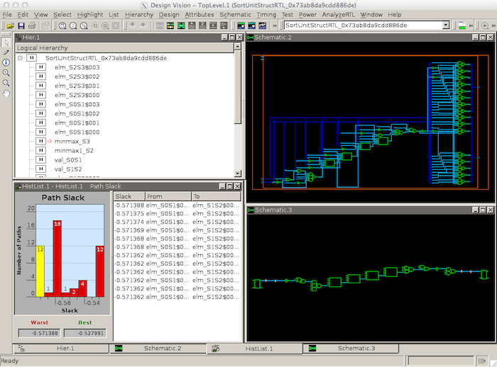

Using Synopsys IC Compiler for Place-and-Route
--------------------------------------------------------------------------

We use Synopsys IC Compiler (ICC) for placing standard cells in rows and
then automatically routing all of the nets between these standard cells.
We also use Synopsys ICC to route the power and ground rails in a grid
and connect this grid to the power and ground pins of each standard cell,
and to automatically generate a clock tree to distribute the clock to all
sequential state elements with hopefully low skew.

We start by creating a subdirectory for our work, and then launching
Synopsys ICC with the GUI.

```
 % mkdir -p $TOPDIR/asic/icc-par
 % cd $TOPDIR/asic/icc-par
 % icc_shell -gui
```

As we enter commands we will be able use the GUI to see incremental
progress towards a fully placed-and-routed design. To make it easier to
copy-and-paste commands from this document, we tell Synopsys ICC to
ignore the prefix `icc_shell>` using the following:

```
 icc_shell> alias "icc_shell>" ""
```

We begin by setting the `target_library` and `link_library` variables as
before.

```
 icc_shell> set_app_var target_library "$env(STDCELLS_DIR)/cells.db"
 icc_shell> set_app_var link_library   "* $env(STDCELLS_DIR)/cells.db"
```

ASIC tools need to manipulate increasingly large amounts of design data
and metadata, so most ASIC tools now leverage either proprietary or open
databases for storing and manipulating design data and metadata. Synopsys
ASIC tools use their own Milkyway database format. Synopsys ICC requires
us to create a new Milkway database for this design. The `create_mw_lib`
command initializes such a database with information about the
interconnect technology (`cells.tf` file) and the abstract physical views
of the standard-cell library (`cells.fr` file).

```
 icc_shell> create_mw_lib -open \
    -tech                 "$env(STDCELLS_DIR)/cells.tf" \
    -mw_reference_library "$env(STDCELLS_DIR)/cells.fr" \
    "LIB"
```

We also need to tell Synopsys ICC more information about the parasitic
resistance and capacitance of each metal layer so it can optimize the
power and signal routing. We use the `set_tlu_plus_files` to point
Synopsys ICC to the `.tluplus` files.

```
 icc_shell> set_tlu_plus_files \
    -max_tluplus  "$env(STDCELLS_DIR)/cells-max.tluplus" \
    -min_tluplus  "$env(STDCELLS_DIR)/cells-min.tluplus" \
    -tech2itf_map "$env(STDCELLS_DIR)/tech2itf.map"
```

We are now ready to import the gate-level Verilog netlist synthesized by
Synopsys DC.

```
 icc_shell> import_designs -format verilog "../dc-syn/post-synth.v"
```

As in Synopsys DC, we must set the clock constraint for timing driven
placement and routing, and static timing analysis.

```
 icc_shell> create_clock clk -name ideal_clock1 -period 1
```

After importing the design you will see all of the standard cells in the
gate-level netlist clustered together in the Synopsys ICC GUI. The first
step is to a floorplan which tells Synopsys ICC how much area we want to
use, how to arrange the rows, where to put the top-level pins, and what
the target utilization should be (higher utilization may result in
smaller area but can also drastically increase tool runtimes). We can use
the `create_floorplan` command with most of the default options.

```
 icc_shell> create_floorplan -core_utilization 0.7
```

The following screen capture illustrates what you should see: a square
floorplan and the cells loosely arranged to the right of the floorplan in
the Synopsys ICC GUI.

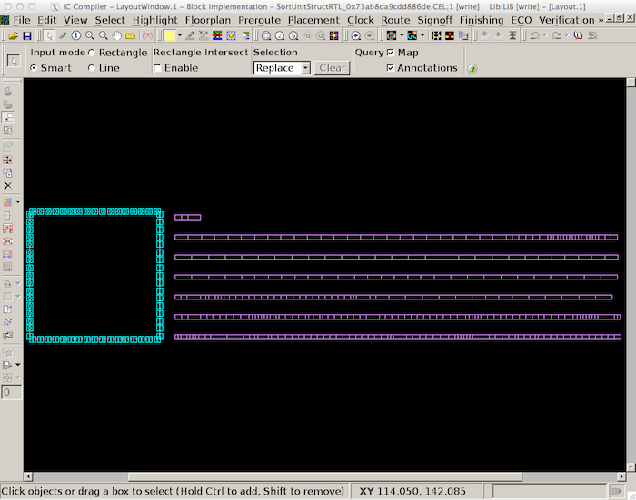

We can use the `create_fp_placement` to do a simple placement of the
cells into the square floorplan.

```
 icc_shell> create_fp_placement
```

Use the "zoom to fit" button in the toolbar to focus on the square
floorplan. The following screen capture illustrates what you should see:
all of the cells arranged into tight rows within the square floorplan.

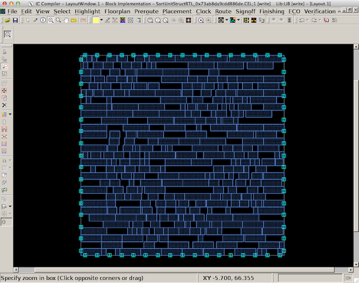

As a quick aside, we have provided you with a different color scheme that
we personally like better by using the following steps:

 - Ensure the _View Settings Toolbar_ is visible by choosing _View > Toolbars > View
Settings_ from the menu
 - Use  the drop-down list next to _Preset_ to choose _ece5745_

Now that the cells are placed in the floorplan, the next step is power
routing. Recall that each standard cell has internal M1 power and ground
rails which will connect via abutment when the cells are placed into
rows. If we were just to supply power to cells using these rails we would
likely have large IR drop and the cells in the middle of the chip would
effectively be operating at a much lower voltage. During power routing,
we create a grid of power and ground wires on the top metal layers and
then connect this grid down to the M1 power rails in each row. We also
create a power ring around the entire floorplan. Before doing the power
routing, we need to use the `derive_pg_connection` command to tell
Synopsys IC compiler which nets are power and which nets are ground
(there are _many_ possible names for power and ground!).

```
 icc_shell> derive_pg_connection \
  -power_net  "VDD" -power_pin  "VDD" \
  -ground_net "VSS" -ground_pin "VSS" \
  -create_ports top
```

Now we can use the `synthesize_fp_rail` command to create the power grid
and power connections. We need to tell Synopsys ICC what our power budget
is (e.g., 1W), what the target voltage supply is (e.g., 1.2V), and our
target max IR drop (e.g., 250mV).

```
 icc_shell> synthesize_fp_rail \
  -power_budget 1000 -voltage_supply 1.2 -target_voltage_drop 250 \
  -nets "VDD VSS" \
  -create_virtual_rails "M1" \
  -synthesize_power_plan -synthesize_power_pads -use_strap_ends_as_pads
```

The following screen capture illustrates what you should now see: a
high-level colormap of the IR drop across the floorplan. You can see that
the middle of the floorplan has the highest IR drop (~150mV) while the
edge of the floorplan has the lowest IR drop. This specific power routing
plan is not the best, and we would probably want to iterate a bit, but it
is good enough for first-order area, energy, and timing analysis.


We can go ahead and commit the power routing plan using the
`commit_fp_rail` command.

```
 icc_shell> commit_fp_rail
```

The following screen capture illustrates what you should now see: a top
metal-layer grid with horizontal M9 and vertical M8. Synopsys IC will
report a bunch of warnings which suggest it is having trouble actually
doing the final power routing. Ideally we would need to dig in and fix
these warnings but again for now it is probably fine for first-order
area, energy, and timing analysis.

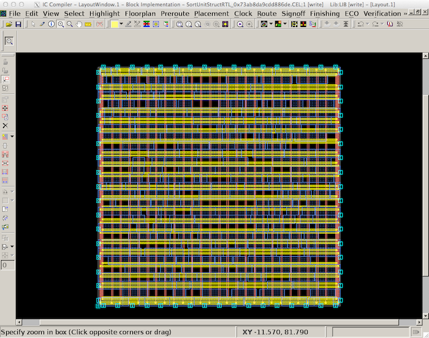

Now that the cells are placed in the floorplan, and we have finished
power routing, the next step is clock tree synthesis. We first need to
create a new clock just like we did in Synopsys DC so that Synopsys ICC
knows which net is the clock and the target clock frequency. We can then
use the `clock_opt` command to do the actual clock tree synthesis.

```
 icc_shell> clock_opt
```

You can use the following steps to highlight the clock tree:

 - Choose _Clock > Color By Clock Trees_ from the menu
 - Select _Reload_ in the sidebar on right
 - Click _OK_ in the pop-up window

The following screen capture illustrates what you should now see: an
RC-balanced clock tree highlighted in yellow. Notice how the clock enters
the floorplan in the lower-left-hand corner and then branches off to
create a tree.

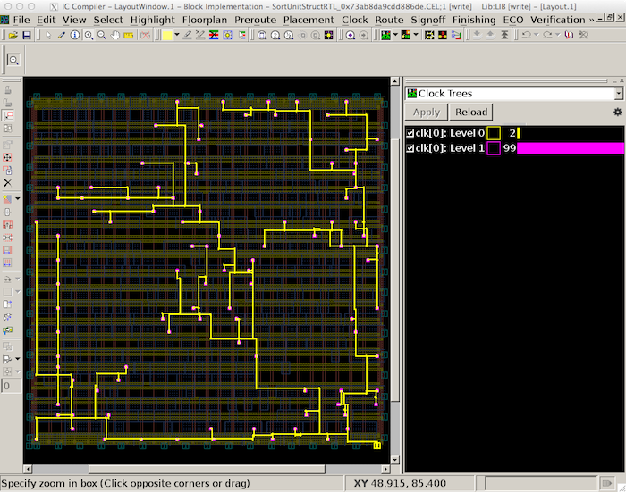

The final major step is to route all of the signals in the design. We do
this with the `route_opt` command.

```
 icc_shell> route_opt
```

Zoom into the design to see some of the detailed routing. The following
screen capture illustrates what you should now see. All routes on a given
metal layer always go in one direction: M2 vertical, M3 horizontal, M4
vertical, M5 horizontal, etc. All routing is on a predefined grid of
routing tacks, and all pins are also on the same grid to simplify
automatic routing.

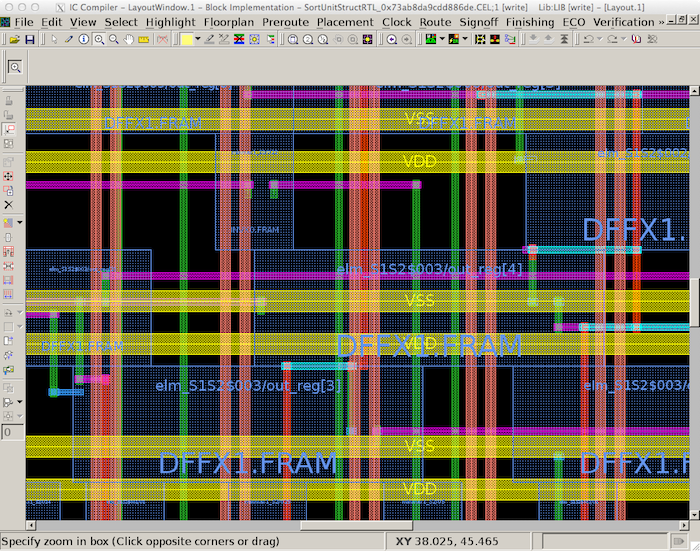

The final step is to insert "filler cells" in between the standard cells.
Filler cells are like standard cells except they do not contain any
logic. The primary purpose of filler cells is to ensure the M1 power and
ground rails are connected and that there are no design rule violations
with respect to the nwells.

```
 icc_shell> insert_stdcell_filler \
  -cell_with_metal "SHFILL128 SHFILL64 SHFILL3 SHFILL2 SHFILL1" \
  -connect_to_power "VDD" -connect_to_ground "VSS"
```

Our design is now on silicon! We can generate the resulting
post-place-and-route Verilog gate-level netlist.

```
 icc_shell> write_verilog "post-par.v"
```

We can also first extract the parasitic resistance and capacitance for
all routes in the design, and then write these parasitics to an `.sbpf`
file. This parasitic information will be used for power analysis.

```
 icc_shell> extract_rc
 icc_shell> write_parasitics -format sbpf -output "post-par.sbpf"
```

We also need to generate the final layout which is what we might
eventually send off to the foundry for fabrication. We can do this by
first streaming in the `.gds` for all of the standard cells and then
streaming out the complete design including all of the instantiated
standard cells.

```
 icc_shell> read_stream  -format gds "$env(STDCELLS_DIR)/cells.gds"
 icc_shell> write_stream -format gds post-par.gds
```

As in Synopsys DC, we can use various commands to generate reports about
area, energy, and timing. The `report_timing` command will show the
critical path through the design. Part of the report is displayed below.

```
 icc_shell> report_timing -nosplit -transition_time -nets -attributes
 ...
  Point                                       Fanout     Trans  Incr  Path
  --------------------------------------------------------------------------
  clock ideal_clock1 (rise edge)                                0.00  0.00
  clock network delay (propagated)                              0.00  0.00
  elm_S0S1$003/out_reg[1]/CLK (DFFX1)                     0.01  0.00  0.00 r
  elm_S0S1$003/out_reg[1]/Q (DFFX1)                       0.06  0.18  0.18 r
  elm_S0S1$003/out[1] (net)                     4               0.00  0.18 r
  elm_S0S1$003/out[1] (Reg_0x45f1552f10c5f05d_5)                0.00  0.18 r
  elm_S0S1$003$out[1] (net)                                     0.00  0.18 r
  minmax1_S1/in1[1] (MinMaxUnit_0x152ab97dfd22b898_0)           0.00  0.18 r
  minmax1_S1/in1[1] (net)                                       0.00  0.18 r
  minmax1_S1/U5/Q (OA21X1)                                0.04  0.09  0.27 r
  minmax1_S1/n16 (net)                          1               0.00  0.27 r
  minmax1_S1/U42/QN (AOI222X1)                            0.03  0.12  0.39 f
  minmax1_S1/n17 (net)                          1               0.00  0.39 f
  minmax1_S1/U43/Q (AO221X1)                              0.04  0.06  0.45 f
  minmax1_S1/n18 (net)                          1               0.00  0.45 f
  minmax1_S1/U44/Q (OA221X1)                              0.04  0.08  0.52 f
  minmax1_S1/n19 (net)                          1               0.00  0.52 f
  minmax1_S1/U45/Q (AO221X1)                              0.05  0.07  0.59 f
  minmax1_S1/n20 (net)                          2               0.00  0.59 f
  minmax1_S1/U46/Q (OA221X1)                              0.04  0.08  0.67 f
  minmax1_S1/n21 (net)                          1               0.00  0.67 f
  minmax1_S1/U47/Q (OA22X1)                               0.04  0.07  0.74 f
  minmax1_S1/n23 (net)                          2               0.00  0.74 f
  minmax1_S1/U23/QN (AOI21X2)                             0.07  0.10  0.85 r
  minmax1_S1/n8 (net)                          12               0.00  0.85 r
  minmax1_S1/U10/Q (AO22X1)                               0.05  0.08  0.93 r
  minmax1_S1/out_min[3] (net)                   1               0.00  0.93 r
  minmax1_S1/out_min[3] (MinMaxUnit_0x152ab97dfd22b898_0)       0.00  0.93 r
  minmax1_S1$out_min[3] (net)                                   0.00  0.93 r
  elm_S1S2$002/in_[3] (Reg_0x45f1552f10c5f05d_10)               0.00  0.93 r
  elm_S1S2$002/in_[3] (net)                                     0.00  0.93 r
  elm_S1S2$002/out_reg[3]/D (DFFX1)                       0.05  0.00  0.93 r
  data arrival time                                                   0.93

  clock ideal_clock1 (rise edge)                                1.00  1.00
  clock network delay (propagated)                              0.00  1.00
  elm_S1S2$002/out_reg[3]/CLK (DFFX1)                           0.00  1.00 r
  library setup time                                           -0.07  0.94
  data required time                                                  0.94
  --------------------------------------------------------------------------
  data required time                                                  0.94
  data arrival time                                                  -0.93
  --------------------------------------------------------------------------
  slack (MET)                                                         0.01
```

Recall that our post-synthesis timing report identified a critical path
starting at the `elm_S0S1[2]` register and ending at the `elm_S1S2[3]`
register, but our post-place-and-route timing report has identified a
different critical path starting at the `elm_S0S1[3]` register and ending
at the `elm_S1S2[2] register. In addition, the estimated worst case
critical path delay in the post-synthesis timing report was 1.49ns with
an estimated cycle time of 1.57ns, however our post-place-and-route
timing report now estimates the worst case critical path is only 0.93ns
and the cycle time would actually be faster than the target of 1ns. This
large discrepancy is because the post-synthesis timing report must make
very rough assumptions about placement and thus interconnect delay, while
the post-place-and-route timing report uses the real placement to create
a much more accurate estimate of the interconnect delay. In this case,
the post-synthesis interconnect delay estimate was far too conservative,
but it is also very possible for the post-synthesis interconnect delay
estimate to be far too optimistic. This is why we avoid using
post-synthesis timing reports for meaningful design-space exploration,
and we instead focus on post-place-and-route timing reports.

We can also graphically view how the critical path traverses the final
layout using the following steps:

 - Choose _Timing > New Timing Analysis Window_ from the menu
 - Focus on _Select Paths_ window, click _OK_
 - List of paths should appear
 - Select first path (critical path) to see it highlighted in the layout view

The following screen capture shows the critical path for the sort unit on
the final layout.

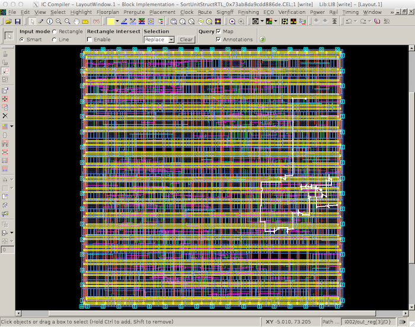

As in Synopsys DC, the `report_area` command can show how much area each
module uses and can enable detailed area breakdown analysis.

```
 icc_shell> report_area -nosplit -hierarchy
 ...
 Combinational area:               2210.918383
 Buf/Inv area:                      392.601609
 Noncombinational area:            2463.436769
 Macro/Black Box area:                0.000000
 Net Interconnect area:             175.165808

 Total cell area:                  4674.355152
 Total area:                       4849.520960

                     Global      Local
                     Cell Area   Cell Area
                     ----------  ----------------
 Hierarchical cell   Abs                Non    Black-
                     Total  %    Comb   Comb   boxes
 ------------------  -----  ---  -----  -----  ---  -------------------------------
 SortUnitStructRTL  4674.3  100    0.0    0.0  0.0  SortUnitStructRTL
 elm_S0S1$000        205.5  4.4    6.4  199.0  0.0  Reg_0x45f1552f10c5f05d_8
 elm_S0S1$001        205.5  4.4    6.4  199.0  0.0  Reg_0x45f1552f10c5f05d_7
 elm_S0S1$002        211.9  4.5   12.9  199.0  0.0  Reg_0x45f1552f10c5f05d_6
 elm_S0S1$003        199.0  4.3    0.0  199.0  0.0  Reg_0x45f1552f10c5f05d_5
 elm_S1S2$000        204.5  4.4    5.5  199.0  0.0  Reg_0x45f1552f10c5f05d_0
 elm_S1S2$001        204.5  4.4    5.5  199.0  0.0  Reg_0x45f1552f10c5f05d_11
 elm_S1S2$002        199.0  4.3    0.0  199.0  0.0  Reg_0x45f1552f10c5f05d_10
 elm_S1S2$003        204.5  4.4    5.5  199.0  0.0  Reg_0x45f1552f10c5f05d_9
 elm_S2S3$000        199.0  4.3    0.0  199.0  0.0  Reg_0x45f1552f10c5f05d_4
 elm_S2S3$001        199.0  4.3    0.0  199.0  0.0  Reg_0x45f1552f10c5f05d_3
 elm_S2S3$002        199.0  4.3    0.0  199.0  0.0  Reg_0x45f1552f10c5f05d_2
 elm_S2S3$003        199.0  4.3    0.0  199.0  0.0  Reg_0x45f1552f10c5f05d_1
 minmax0_S1          429.4  9.2  429.4    0.0  0.0  MinMaxUnit_0x152ab97dfd22b898_3
 minmax0_S2          438.6  9.4  438.6    0.0  0.0  MinMaxUnit_0x152ab97dfd22b898_4
 minmax1_S1          434.9  9.3  434.9    0.0  0.0  MinMaxUnit_0x152ab97dfd22b898_0
 minmax1_S2          467.2 10.0  467.2    0.0  0.0  MinMaxUnit_0x152ab97dfd22b898_2
 minmax_S3           364.9  7.8  364.9    0.0  0.0  MinMaxUnit_0x152ab97dfd22b898_1
 val_S0S1             35.9  0.8   11.0   24.8  0.0  RegRst_0x2ce052f8c32c5c39_1
 val_S1S2             35.9  0.8   11.0   24.8  0.0  RegRst_0x2ce052f8c32c5c39_2
 val_S2S3             35.9  0.8   11.0   24.8  0.0  RegRst_0x2ce052f8c32c5c39_0
 ------------------ ------  --- ------ ------  ---  -------------------------------
 Total                          2210.9 2463.4  0.0
```

If we compare our post-synthesis area report to the post-place-and-route
area report, we will see they are roughly in the same ballpark, although
they are definitely not identical. The post-place-and-route area report
is far more accurate since it incorporates the actual placement of the
standard cells along with filler cells. In general, we will always be
using post-place-and-route area estimates.

We can also graphically view which cells are associated with various
modules in the layout using the following steps:

 - Choose _Placement > Color By Hierarchy_ from the menu
 - select _Reload_ in the sidebar on right
 - Select _Color hierarchical cells at level_ in the pop-up window
 - Click _OK_ in the pop up

We call the resulting plot an "amoeba plot" because the tool often
generates blocks that look like amoebas. The following screen capture
shows the amoeba plot for the sort unit.

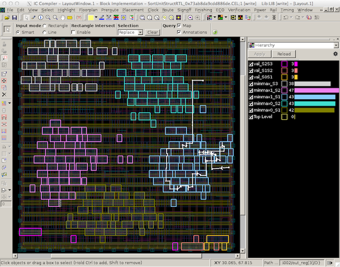

The sidebar on the right you can see how many cells are in each module,
and you can also see how the critical path physically goes through
`minmax1_S1` as indicated in the post-place-and-route timing report.

As in Synopsys DC, we can use the `report_power` command can show how
much power each module consumes, but since this estimate will still use
statistical power estimation it is still not of much use.

```
 icc_shell> report_power -nosplit -hierarchy
```

Finally, we go ahead and save/close the Milkyway databse and exit
Synopsys ICC.

```
 icc_shell> close_mw_lib -save
 icc_shell> exit
```

We can now look at the actual `.gds` file for our design to see the final
layout including all of the cells and the interconnect using the
open-source Klayout GDS viewer.

```
 % cd $TOPDIR/asic/icc-par
 % klayout -l $STDCELLS_DIR/cells.lyp post-par.gds
```

The following screen capture illutrates using Klayout to view the layout
for the entire sort unit.

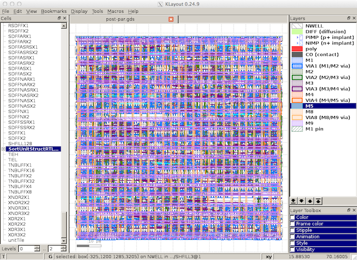

The following figure shows a zoomed portion of the layout. You can
clearly see the active layer inside the standard cells along with the
signal routing on the lower metal layers and the power routing on the
upper metal layers.

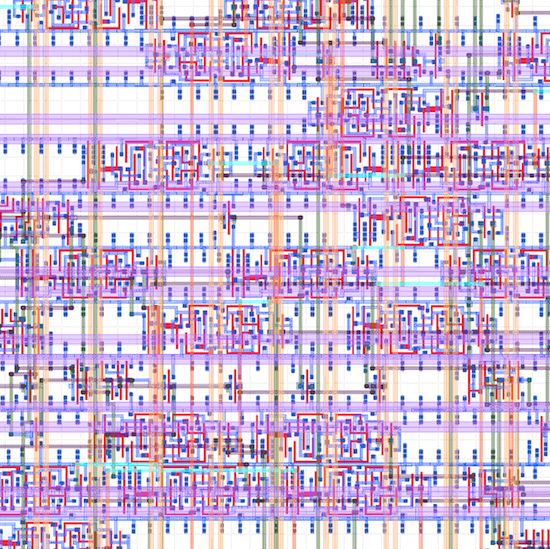

Using Synopsys PrimeTime for Power Analysis
--------------------------------------------------------------------------

Synopsys PrimeTime (PT) is primarily used for very accurate "sign-off"
static timing analysis (more accurate than the analysis performed by
Synopsys DC and ICC), but in this course, we will only use Synopsys PT
for power analysis. There are many ways to perform power analysis. As
mentioned earlier, the post-synthesis and post-place-and-route power
reports use statistical power analysis where we simply assume some toggle
probability on each net. For more accurate power analysis we need to find
out the actual activity for every net for a given experiment. One way to
do this is to perform post-place-and-route gate-level simulation. In
other words, we can run a benchmark executing on the gate-level netlist
generated after place-and-route. These kind of gate-level simulations can
be very, very slow and are tedious to setup correctly.

In this course we will use a simpler approach that is slightly less
accurate than gate-level simulation. We will use the per-net activity
factors from the RTL simulation which were stored in an `.saif` file
earlier in this tutorial. The challenge is that the activity factors in
the `.saif` file are from RTL simulation, and the RTL model is obviously
not a one-to-one match with the gate-level model. The RTL model might
have had a net called `result_plus_4`, but the logic may have been
optimized during synthesis and place-and-route such that this net is
simply not in the gate-level model. Similarly, the gate-level model will
have many nets which do not map to corresponding nets in the RTL model.
Fortunately, there will be many nets that _do_ match between the RTL and
gate-level models. For example, if we have a register in our RTL model
then that register is guaranteed to be in the gate-level model. So if we
know the activity factor of each bit in the register from the `.saif`
file, then we know the activity factor or each corresponding flip-flop in
the gate-level model. Similarly, if we have a module port in our RTL
model and we have not flattened the design, then that module port is
guaranteed to be in the gate-level model (another good reason not to
flatten your design!). Synopsys PT can use sophisticated algorithms
including many tiny little gate-level simulations of just a few gates in
order to estimate the activity factor of all nets downstream from the
valid activity factors included in the `.saif`. For more information
about this kind of power analysis, consult Chapter 5 (more specifically,
the section titled "Estimating Non-Annotated Switching Activity" of the
[PrimeTime PX User
Guide](http://www.csl.cornell.edu/courses/ece5745/syndocs/ptpx.pdf).

We start by creating a subdirectory for our work, and then launching
Synopsys PT.

```
 % mkdir -p $TOPDIR/asic/pt-pwr
 % cd $TOPDIR/asic/pt-pwr
 % pt_shell
```

To make it easier to copy-and-paste commands from this document, we tell
Synopsys PT to ignore the prefix `pt_shell>` using the following:

```
 pt_shell> alias "pt_shell>" ""
```

We begin by setting the `target_library` and `link_library` variables as
before.

```
 pt_shell> set_app_var target_library "$env(STDCELLS_DIR)/cells.db"
 pt_shell> set_app_var link_library   "* $env(STDCELLS_DIR)/cells.db"
```

Since Synopsys PT is primarily used for static timing analysis, we need
to explicitly tell Synopsys PT that we want to use it for power analysis.

```
 pt_shell> set_app_var power_enable_analysis true
```

We now read in the gate-levle netlist, tell Synopsys PT we want to do
power analysis for the top-level module, and link the design (i.e.,
recursively resolve all of the module references starting from the
top-level module).

```
 pt_shell> read_verilog   "../icc-par/post-par.v"
 pt_shell> current_design SortUnitStructRTL_0x73ab8da9cdd886de
 pt_shell> link_design
```

In order to do power analysis, Synopsys PT needs to know the clock
period. Here we will set the clock frequency to be the same as the
initial clock constraint, but note that this is only valid if our design
has no negative or positive slack. If our design has negative or positive
slack, we want to adjust the clock period to reflect the clock frequency
that can _actually_ be achieved by the design.

```
 pt_shell> create_clock clk -name ideal_clock1 -period 1
```

The key to making this approach to power analysis work, is to ensure as
many nets as possible match between the `.saif` generated from RTL and
the gate-level netlist. Synopsys DC will change the names of various nets
as it does synthesis, so if you recall we used some extra commands in
Synopsys DC to generate a `.namemap` file. This name mapping file maps
high-level RTL names to low-level gate-level names and will result in a
better match between these two models. So the next step is to read in
this previously generated `.namemap` file.

```
 pt_shell> source ../dc-syn/post-synth.namemap
```

We are now ready to read in the actual activity factors which will be
used for power analysis. The `.saif` file comes from a `.vcd` file which
in turn came from running a simulation with a test harness. We need to
strip off part of the instance names in the `.saif` file since the
gate-level netlist does not have this test harness. Again, the key is to
make sure we do everything we can to ensure as many nets as possible
match between the `.saif` generated from RTL and the gate-level netlist.

```
 pt_shell> read_saif "../../sim/build/sort-rtl-struct-random.saif" -strip_path "TOP/v"
```

The `.db` file includes parasitic capacitance estimates for every pin of
every standard cell, but to improve the accuracy of power analysis, we
also need to include parasitic capacitances from the interconnect. Recall
that we used Synopsys ICC to generate exactly this information in a
`.sbpf` file. So we now read in these additional parasitic capacitance
values for every net in the gate-level netlist.

```
 pt_shell> read_parasitics -format sbpf "../icc-par/post-par.sbpf.max"
```

We now have everything we need to perform the power analysis: (1) the
activity factor of a subset set of the nets, (2) the capacitance of every
net/port, (3) the supply voltage, and (4) the clock frequency. We use the
`update_power` command to propagate activity factors to unannotated nest
and to estimate the power of our design.

```
 pt_shell> update_power
```

We can use the `report_power` command to show a high-level overview of
how much power the sort unit consumes.

```
 pt_shell> report_power -nosplit
 ...
                Internal Switching  Leakage Total
 Power Group       Power     Power    Power Power   (     %)
 -----------------------------------------------------------
 clock_network   3.1e-03   0.0      0.0     3.1e-03 (63.27%)  i
 register       -9.1e-05   3.4e-04  1.3e-05 2.6e-04 ( 5.29%)
 combinational   9.9e-04   5.6e-04  1.0e-05 1.5e-03 (31.44%)
 sequential      0.0       0.0      0.0     0.0     ( 0.00%)
 memory          0.0       0.0      0.0     0.0     ( 0.00%)
 io_pad          0.0       0.0      0.0     0.0     ( 0.00%)
 black_box       0.0       0.0      0.0     0.0     ( 0.00%)

  Net Switching Power  = 9.049e-04   (18.15%)
  Cell Internal Power  = 4.057e-03   (81.38%)
  Cell Leakage Power   = 2.351e-05   ( 0.47%)
                         ---------
  Total Power          = 4.985e-03  (100.00%)
```

These numbers are in Watts. We can see that the sort unit consumes ~5mW
of power when processing random input data. Power is the rate change of
energy (i.e., energy divided by execution time), so the total energy is
just the product of the total power, the number of cycles, and the cycle
time. When we ran the sort unit simulator at the beginning of the
tutorial, we saw that the simulation required 105 cycles. Assuming our
sort unit runs as 1ns, this means the total energy is 512pJ. Since we are
doing 100 sorts, this corresponds to about 5.12pJ per sort.

The power is broken down into internal, switching, and leakage power.
Internal and switching power are both forms of dynamic power, while
leakage power is a form of static power. Notice that in this case, the
dynamic power is much more significant than the static power. Internal
power was described earlier in this tutorial, so you may want to revisit
that section. Note that internal power includes short circuit power, but
it can also include the local clock power internal to the cell. In this
overview, the power is also broken down by the power consumed in the
global clock network, registers, and combinational logic. Note that the
internal power for the registers is negative. This is normal. As
mentioned earlier in this tutorial, this is just an artifact of how we
do the accounting. Switching power is the power dissipated by the
charging and discharging of the load capacitance at the output of each
cell. Leakage power is the constant power due to subthreshold leakage.
Sometimes we might want to factor out the static leakage power and focus
more on the dynamic energy since including leakage power would mix energy
and performance (i.e., using more cycles requires more leakage power even
if we are not doing any more work during those cycles).

Although the above breakdown is somewhat useful, it is even more useful
to use the `report_power` command to show how much power each module
consumes in the design.

```
 pt_shell> report_power -nosplit -hierarchy
 ...
                            Int      Switch   Leak     Total
 Hierarchy                  Power    Power    Power    Power        %
 ---------------------------------------------------------------------
 SortUnitStructRTL          4.06e-03 9.05e-04 2.35e-05 4.99e-03 100.0
  elm_S1S2$000 (Reg_0)      2.51e-04 3.90e-05 1.09e-06 2.91e-04   5.8
  elm_S1S2$001 (Reg_11)     2.62e-04 4.22e-05 1.11e-06 3.05e-04   6.1
  elm_S1S2$002 (Reg_10)     2.49e-04 2.90e-05 1.07e-06 2.80e-04   5.6
  elm_S1S2$003 (Reg_9)      2.55e-04 2.94e-05 1.11e-06 2.86e-04   5.7
  elm_S2S3$000 (Reg_4)      2.07e-04 1.79e-06 1.05e-06 2.09e-04   4.2
  elm_S2S3$001 (Reg_3)      2.57e-04 3.14e-05 1.08e-06 2.89e-04   5.8
  elm_S2S3$002 (Reg_2)      2.58e-04 3.02e-05 1.08e-06 2.89e-04   5.8
  elm_S2S3$003 (Reg_1)      2.20e-04 3.91e-07 1.08e-06 2.21e-04   4.4
  val_S0S1 (RegRst_1)       2.31e-05 1.48e-07 1.64e-07 2.34e-05   0.5
  val_S2S3 (RegRst_0)       2.34e-05 2.00e-07 1.64e-07 2.38e-05   0.5
  minmax0_S1 (MinMaxUnit_3) 1.93e-04 1.13e-04 1.90e-06 3.08e-04   6.2
  minmax0_S2 (MinMaxUnit_4) 1.99e-04 1.10e-04 1.99e-06 3.11e-04   6.2
  minmax1_S1 (MinMaxUnit_0) 2.03e-04 1.15e-04 1.99e-06 3.20e-04   6.4
  minmax1_S2 (MinMaxUnit_2) 2.12e-04 1.23e-04 2.13e-06 3.37e-04   6.8
  val_S1S2 (RegRst_2)       2.33e-05 1.49e-07 1.64e-07 2.36e-05   0.5
  minmax_S3 (MinMaxUnit_1)  1.69e-04 8.15e-05 1.63e-06 2.52e-04   5.1
  elm_S0S1$000 (Reg_8)      2.66e-04 4.29e-05 1.18e-06 3.10e-04   6.2
  elm_S0S1$001 (Reg_7)      2.57e-04 3.21e-05 1.18e-06 2.90e-04   5.8
  elm_S0S1$002 (Reg_6)      2.75e-04 5.29e-05 1.29e-06 3.29e-04   6.6
  elm_S0S1$003 (Reg_5)      2.56e-04 3.08e-05 1.08e-06 2.88e-04   5.8
```

From this breakdown, you can see a pretty even distribution of the power
across the modules. Note that the power consumed in the registers is
actually comparable or even a bit higher compared to the combinational
logic in each `MinMaxUnit`.

Finally, we go ahead and exit Synopsys PT.

```
 pt_shell> exit
```

Take a few minutes to reflect on all we have accomplished. We have taken
an initial RTL design and transformed into detailed layout, but we have
also been able to quantitatively analyze the area, energy, and timing of
this design using a state-of-the-art ASIC toolflow.

Using Verilog RTL Models
--------------------------------------------------------------------------

Students are welcome to use Verilog instead of PyMTL to design their RTL
models. Having said this, we will still exclusively use PyMTL for all
test harnesses, FL/CL models, and simulation drivers. This really
simplifies managing the course, and PyMTL is actually a very productive
way to test/evaluate your Verilog RTL designs. We use PyMTL's Verilog
import feature described in the Verilog tutorial to make all of this
work. The following commands will run all of the tests on the _Verilog_
implementation of the sort unit.

```
 % cd $TOPDIR/sim/build
 % rm -rf *
 % py.test ../tut4_verilog/sort
```

As before, the tests for the SortUnitStructRTL will fail. You can just
copy over your implementation of the MinMaxUnit from when you completed
the Verilog tutorial. If you have not completed the Verilog tutorial then
go back and do that now. After running the tests we use the sort unit
simulator to translate the PyMTL RTL model into Verilog and to dump the
VCD file that we want to use for power analysis.

```
 % cd $TOPDIR/sim/build
 % ../tut4_verilog/sort/sort-sim --impl rtl-struct --translate --dump-vcd
 % vcd2saif -input sort-rtl-struct-random.verilator1.vcd -output sort-rtl-struct-random.saif
```

Take a moment to open up the translated Verilog which should be in a file
named `SortUnitStructRTL_0x73ab8da9cdd886de.v`. You might ask, "Why do we
need to use PyMTL to translate the Verilog if we already have the
Verilog?" PyMTL will take care of preprocessing all of your Verilog RTL
code to ensure it is in a single Verilog file. This greatly simplifies
getting your design into the ASIC flow. This also ensures a one-to-one
match between the Verilog that was used to generate the VCD file and the
Verilog that is used in the ASIC flow.

Once you have tested your design and generated the single Verilog file
and the VCD file, you can push the design through the ASIC flow using the
exact same steps we used above.

On Your Own
--------------------------------------------------------------------------

Spend some time experimenting with the flow. Try pushing either the PyMTL
or Verilog implementation of the sort unit through the flow with a more
aggressive cycle time (e.g., 0.9ns). Can the design operate at this
higher clock frequency?

Try flattening the design during synthesis by using this command:

```
 dc_shell> compile -ungroup_all
```

or try using the `compile_ultra` command with (or without) flattening to
 see if it improves the quality of results.

```
 dc_shell> compile_ultra -no_autoungroup
```
